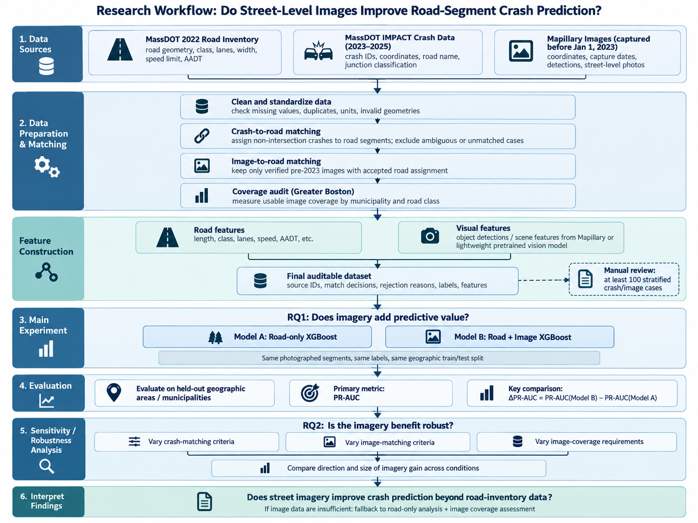

# Do Street-Level Images Improve Road-Segment Crash Prediction?
**Chun Hsu · Bryan Ayala · Wei-Tung Hung · Mariam Fondong · Adilbek Bekmuldin**

## Project description and motivation

Road inventories describe traffic volume, road class, lanes, and speed limits, but may not fully capture visible conditions such as vegetation and sidewalks. We will test whether visual features improve road-segment crash prediction beyond road-inventory data, and whether the conclusion depends on spatial matching and image coverage.

We will combine Massachusetts road records, MassDOT IMPACT crashes, and Mapillary photographs captured **before January 1, 2023**. The prediction target is whether a road segment has at least one supported, matched, police-reported **non-intersection crash during 2023–2025**. Intersection crashes are excluded because several adjoining segments may be plausible assignments; they require a different analysis unit. The study measures predictive associations and will not identify causal effects of street design.

[Biljecki and Ito (2021)](https://doi.org/10.1016/j.landurbplan.2021.104217) provide broader context on street imagery in urban analytics and GIS, including its applications and limitations.

Prior work supports using street imagery to characterize road environments: [Ye et al. (2025)](https://doi.org/10.1007/s12061-025-09653-7) review its applications in crash and safety analysis, and [Yue (2025)](https://doi.org/10.1016/j.aap.2024.107851) extracts streetscape characteristics using computer vision.

## Research questions and measurable goals

**RQ1 — Primary prediction question:** Does street-level imagery provide additional predictive value beyond conventional road-inventory features?

**RQ2 — Robustness question:** How sensitive is the observed imagery benefit to crash-to-road matching criteria, image-to-road matching criteria, and differences in image coverage?

RQ2 tests conclusion stability under specified pipeline changes; it does not model uncertainty.

1. **Build an auditable dataset.** Store source identifiers, road attributes, crash labels, image dates, candidate distances, match decisions, and rejection reasons. Manually review at least **100 stratified cases**: at least 50 crash cases and 50 image cases, including supported, ambiguous, and unmatched examples. Report agreement with the recorded assignments and common failure modes.
2. **Measure imagery's incremental value.** Select and extract visual features informed by a literature review of those found most useful in prior crash-prediction studies. Compare road-only and road-plus-image XGBoost models on identical segments and geographic test assignments. Report held-out average precision, termed **PR-AUC** here, and **ΔPR-AUC = PR-AUC(image model) − PR-AUC(road-only model)**.
3. **Assess conclusion stability.** Conduct approximately two to three focused sensitivity checks addressing crash matching, image matching, or image coverage. Report ΔPR-AUC, cohort composition, and prevalence for each condition. A gain that disappears or reverses under stricter rules is a meaningful result; improvement is a hypothesis, not a requirement for project success.

## Data collection plan

| Source | Required data | Collection method |
| --- | --- | --- |
| [MassDOT 2022 Road Inventory](https://gis.massdot.state.ma.us/arcgis/rest/services/Roads/RoadInventoryYearEndFiles/FeatureServer/8) | Segment geometry, length, road class, lanes, width, speed, AADT, and measurement year | Paginated ArcGIS REST API requests; preserve the 2022 snapshot and field definitions. |
| [MassDOT IMPACT annual crash layers](https://gis.crashdata.dot.mass.gov/arcgis/rest/services/MassDOT) | 2023–2025 crash identifiers, coordinates, reported road name, and junction classification | Paginated ArcGIS REST API requests; deduplicate records and retain matching audit fields. |
| [Mapillary API](https://www.mapillary.com/developer) | Coordinates, capture dates, available precomputed visual detections, and street photographs where needed | Query eligible images and their available processed outputs through the API; download representative photographs when local feature extraction is needed. |

Cleaning will follow the [MassDOT data dictionary](https://www.mass.gov/doc/road-inventory-data-dictionary/download): check units, missing-value codes, duplicate features, and invalid geometries. AADT will come from the pre-outcome inventory snapshot. Unknown measurement years and missing values will be flagged; missing AADT will receive training-fitted imputation. AADT and segment length approximate differences in traffic exposure, but the binary target is not a crash rate per traveler. Busier and longer road segments generally have more opportunities for crashes because they carry more vehicle travel. A higher predicted probability of at least one crash therefore does not necessarily mean that an individual traveler faces greater risk on that segment.

## Geographic scope and preliminary feasibility

Statewide road and crash records are already available. The imagery experiment will focus on Greater Boston, beginning with a Mapillary metadata coverage audit in Boston and nearby municipalities. For each municipality and road class, we will measure the number and proportion of screened MassDOT segments with usable pre-2023 imagery, along with capture dates and image-matching quality. The existing Boston pilot confirms that some pre-outcome images are available, but does not establish the sample size obtainable across Greater Boston. We will therefore determine the final municipalities and segment count from this audit, considering geographic coverage and the collection and processing workload that can be completed within eight weeks. Sampling decisions will use image metadata and road attributes, without selecting locations by crash outcomes.

Existing pilots provide feasibility evidence:

- The statewide road-only XGBoost pilot used **547,849 eligible segments**. Its PR-AUC was **0.541** on **98,371 segments from 71 held-out municipalities**, with positive prevalence **0.147**. This exploratory score uses the existing matching-defined label and does not demonstrate imagery's value.
- In the Back Bay / South End pilot, **150 of 724 displayed segments** had pre-2023 imagery; **28** of those 150 had a supported 2023–2025 crash. This local coverage cannot be extrapolated statewide.
- Approximately **75%** of statewide segments have AADT, but only **31%** have both AADT and its measurement year. Traffic-volume records are therefore incomplete exposure proxies.

At the end of **Week 2**, we will publish the coverage audit and freeze geography, sampling, and geographic train/test assignments. By Week 3, we will report the final cohort size and positive and negative counts in each split. If image coverage or the number of held-out positive cases is too limited to support an informative model comparison, we will activate the fallback and describe the image results as exploratory. These counts will guide the feasibility assessment, without being used to select different towns or redraw the test split.

## Planned analysis and evaluation

### Dataset and label construction

The analysis unit will be one eligible 2022 MassDOT road-inventory line record. We will measure the distance from each crash location to nearby road segments in meters. To assess which segment it belongs to, we will check whether the reported road name matches the segment’s name and whether another nearby segment is almost equally close. Explicit intersection records and unknown junction classifications will be excluded from the final non-intersection analysis and counted separately. We will use the source data’s junction codes and definitions to identify non-intersection crashes, and manually review a sample to check that these records are classified correctly.

Crashes that cannot be assigned clearly to one segment will remain unmatched. If any planned crash-matching rule leaves an assignment unclear, all candidate segments for that unresolved crash will be excluded from every crash-matching comparison. Each comparison will therefore use the same set of road segments. A zero means **no supported crash assigned under that condition**, not proof that no crash occurred. The audit will document events omitted by stricter matching rules.

Images must have a verified pre-2023 capture date and an accepted road assignment. Representative images will be selected using fixed date and geometric rules without consulting crash outcomes. We will first review prior street-imagery and crash studies, including the work cited above, to select a small set of visual features. We will prioritize precomputed visual information available through the Mapillary API, such as [object detections](https://help.mapillary.com/hc/en-us/articles/115000967191-Object-detections), using results linked to eligible pre-2023 images. If required features are unavailable or insufficient, we will supplement them using a lightweight pretrained vision model that can run on our local hardware. The final feature set will depend on the literature, API availability, and a small-scale feasibility test. We will record feature sources and manually check sample outputs; missing detections will not automatically be treated as evidence that an object is absent. If we use pixel proportions, we will interpret them as visible scene characteristics rather than physical road or sidewalk widths. Image age, season, and viewpoint will be documented where available.

### Main experiment: RQ1

We will compare two models: **Model A**, using conventional road-inventory features such as road length, road class, lanes, speed limits, and AADT; and **Model B**, using the same features plus visual features selected through the literature review. We plan to use XGBoost, with final preprocessing and model settings determined after examining the data.

The models will be evaluated on **the same photographed road segments, crash labels, and training/test split**. We will hold out municipalities or spatial areas to assess performance on locations excluded from training, informed by [Roberts et al. (2017)](https://doi.org/10.1111/ecog.02881) on validation of spatially structured data. Our primary measure will be held-out **PR-AUC and the difference between the models**, reported alongside sample sizes and the proportion of segments with crashes. Data preparation and model selection will use training data only.

### Sensitivity analysis: RQ2

We will conduct a small number of sensitivity checks to examine whether the observed benefit of imagery remains consistent under alternative crash/image matching criteria and image-coverage requirements. For example, we may compare the main dataset with a subset containing more confident spatial matches or better image coverage. The specific conditions will be selected after the data-quality review, before examining test results, and kept feasible within the eight-week schedule.

Within each condition, the road-only and road-plus-image models will use the same data and test split. We will compare the direction and approximate size of the imagery gain across conditions, while reporting changes in sample size and crash prevalence. If the advantage disappears under stricter criteria, that will be a meaningful finding about how the conclusion depends on the data pipeline.

## Eight-week work plan

The schedule builds on the existing data-access, matching, modeling, and visualization pilots. Tasks will overlap: we will test API-provided visual information and, if needed, local extraction on a small sample before committing to full collection, begin the road-only baseline while image processing continues, and document methods and results throughout the project.

Our five-person team will organize work into three technical streams—data preparation and matching, visual-feature collection and extraction, and modeling and evaluation—supported by literature review, manual data checks, and reporting and visualization. Each stream will have a lead and a teammate who can review and reproduce its outputs. Weekly deliverables and progress checks will allow tasks to be reassigned when availability changes. The scope is sized around these three technical streams, with the remaining contributions supporting quality checks and communication.

| Week | Task | Deliverable |
| --- | --- | --- |
| 1 | Review prior studies, inspect existing data and code, and begin cleaning | Literature summary, candidate visual features, and data-quality findings |
| 2 | Check pre-2023 coverage and API visual outputs; test local extraction if needed | Feature-availability and quality assessment, local processing feasibility where needed, study scope, and geographic split |
| 3 | Collect and match the selected data, review matching cases, and begin the road-only baseline | Joined dataset, at least 100 reviewed crash/image cases, and a decision on cohort feasibility |
| 4 | Complete visual-feature collection and any necessary local extraction; check outputs and the comparison pipeline using training data | Validated feature table and a working road-only/road-plus-image comparison |
| 5 | Refine preprocessing and fit both models on the final shared cohort | Models and evaluation procedure finalized before testing |
| 6 | Evaluate the main comparison, begin sensitivity checks, and draft the results | RQ1 results, initial RQ2 findings, and report draft |
| 7 | Complete selected sensitivity checks and error analysis; update the existing explorer | RQ2 comparison, documented limitations, and updated visualization |
| 8 | Finalize the report and presentation, check reproducibility, and resolve remaining issues | Final report, reproducible code, and presentation |

The Week 2 API and local-processing checks will guide the workload and feature choices. By the end of Week 3, limited image coverage or unavailable usable visual features will trigger a reduced image scope or the fallback below. The final week includes time for corrections rather than new experiments.

The existing explorer will display coverage, match examples, and held-out predictions alongside the evaluation tables.

## Visualization plan

We will use three static figures to answer the research questions and a simple interactive map to inspect individual road segments.

1. **Coverage heatmap:** the share of segments with usable pre-2023 imagery by municipality and road class, showing where the imagery comparison is possible and which roads are underrepresented.
2. **Imagery gain by held-out municipality (RQ1):** a dot plot of ΔPR-AUC for each held-out area, showing whether any benefit from imagery is consistent or driven by a few locations.
3. **Sensitivity comparison (RQ2):** ΔPR-AUC under each matching and coverage condition, annotated with sample size and crash prevalence, since PR-AUC depends on prevalence.

**Interactive map.** A lightweight Folium map, exported as a single HTML file, will color road segments by image coverage, crash label, or predicted probability. Clicking a segment will show its road attributes, a representative pre-2023 image, and both models' predictions. A basic version will be completed by Week 7, with additional features only if time allows.

## Scope controls and fallback

If API features are limited and local processing is slow, we will reduce the feature set and use one representative image per segment for local extraction. We will retain standard XGBoost models and avoid additional model families or advanced uncertainty methods.

If usable visual data are insufficient, we will complete a road-inventory-only analysis within the same Greater Boston study scope and retain the 2023–2025 non-intersection crash outcome. The work will focus on cleaning road and crash data, training and evaluating the road-only model, and examining sensitivity to crash-matching criteria. We will also analyze usable pre-2023 image coverage by municipality and road class, reporting where imagery is available and which types of roads are underrepresented. The imagery-benefit question will remain unanswered, and the final report will explain this limitation.

## References

- Ye, X., et al. (2025). [*Street View Imagery in Traffic Crash and Road Safety Analysis: A Review*](https://doi.org/10.1007/s12061-025-09653-7). *Applied Spatial Analysis and Policy*, 18, Article 50.

  **Key point:** Reviews how street-view features are used in crash and road-safety studies, providing a starting point for selecting relevant visual features and identifying limitations.

- Yue, H. (2025). [*Investigating streetscape environmental characteristics associated with road traffic crashes using street view imagery and computer vision*](https://doi.org/10.1016/j.aap.2024.107851). *Accident Analysis & Prevention*, 210, 107851.

  **Key point:** Demonstrates the extraction of streetscape features with computer vision and their analysis in relation to traffic crashes, informing our candidate features and methods.

- Biljecki, F., & Ito, K. (2021). [*Street view imagery in urban analytics and GIS: A review*](https://doi.org/10.1016/j.landurbplan.2021.104217). *Landscape and Urban Planning*, 215, 104217.

  **Key point:** Reviews street-view applications in urban analytics and GIS, informing how we derive environmental features and assess imagery coverage and quality.

- Roberts, D. R., et al. (2017). [*Cross-validation strategies for data with temporal, spatial, hierarchical, or phylogenetic structure*](https://doi.org/10.1111/ecog.02881). *Ecography*, 40(8), 913–929.

  **Key point:** Explains how dependence between observations can make random validation overly optimistic, motivating our evaluation on geographically separated areas.

---

**AI disclaimer:** OpenAI Codex assisted with drafting and revising this proposal. The team is responsible for reviewing and validating the AI-assisted content, references, code, and results, and for all decisions and conclusions in the final submission.
